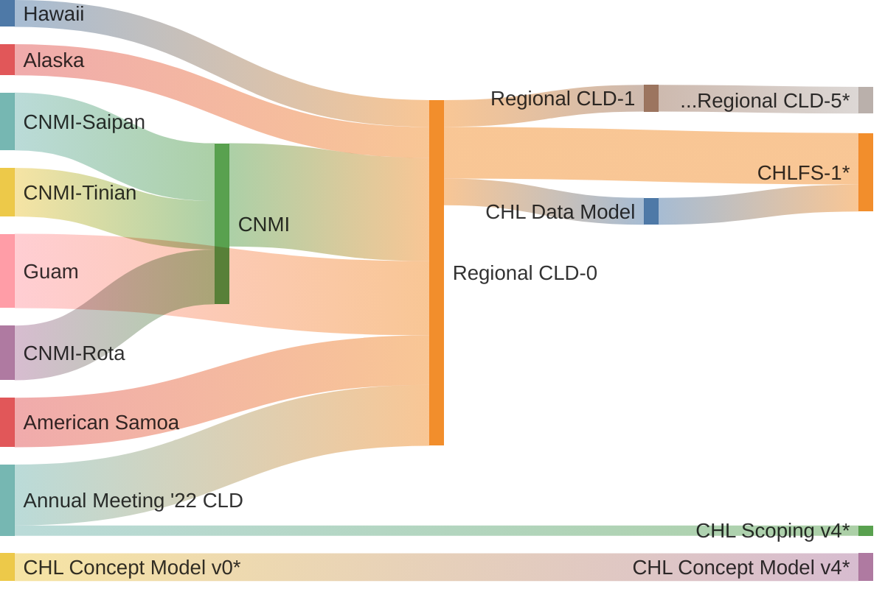

```mermaid
---
config:
  sankey:
    showValues: false
---
sankey-beta


Hawaii,Regional CLD-0,26
Alaska,Regional CLD-0,30
CNMI-Saipan,CNMI,56
CNMI-Tinian,CNMI,47
CNMI-Rota,CNMI,53
CNMI,Regional CLD-0,100
Guam,Regional CLD-0,72
Regional CLD-0,Regional CLD-1,26
Regional CLD-1,...Regional CLD-5*,26
Regional CLD-0,CHL Data Model,26
CHL Data Model,CHLFS-1*,26
Regional CLD-0,CHLFS-1*,50
American Samoa,Regional CLD-0,48
Annual Meeting '22 CLD,Regional CLD-0,59
Annual Meeting '22 CLD,CHL Scoping v4*,10
CHL Concept Model v0*,CHL Concept Model v4*,27 
```
