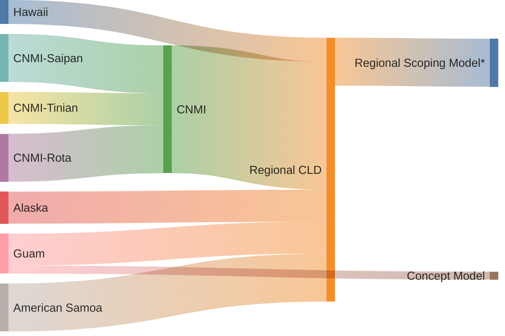

```mermaid
---
config:
  sankey:
    showValues: false
---
sankey-beta

Hawaii,Regional CLD,15
Alaska,Regional CLD,20
CNMI-Saipan,CNMI,30
CNMI-Tinian,CNMI,20
CNMI-Rota,CNMI,30
CNMI,Regional CLD,80
Guam,Regional CLD,20
Guam,Concept Model,5
American Samoa,Regional CLD,30
Regional CLD,Regional Scoping Model*,30
```
