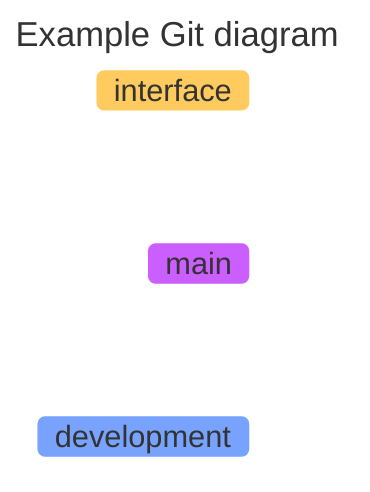

# sandbox-mermaid
Sandbox for testing Mermaid scripting to draw diagrams. Information on Mermaid can be found [here](https://mermaid.js.org/). 

```mermaid
---
title: Example Git diagram
---
%%{init: { 'logLevel': 'debug', 'theme': 'base', 'gitGraph': {'showBranches': true, 'showCommitLabel':true,'mainBranchOrder': 2}} }%%
gitGraph 
  branch development order: 3
  branch interface order: 1
```
