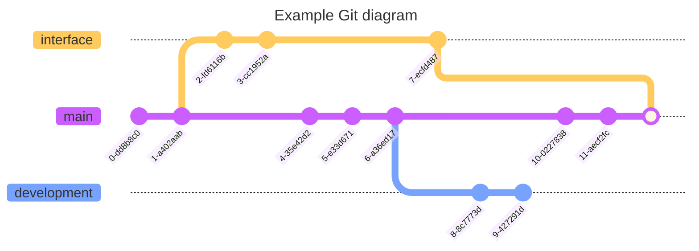
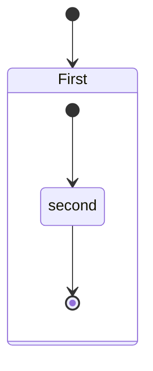
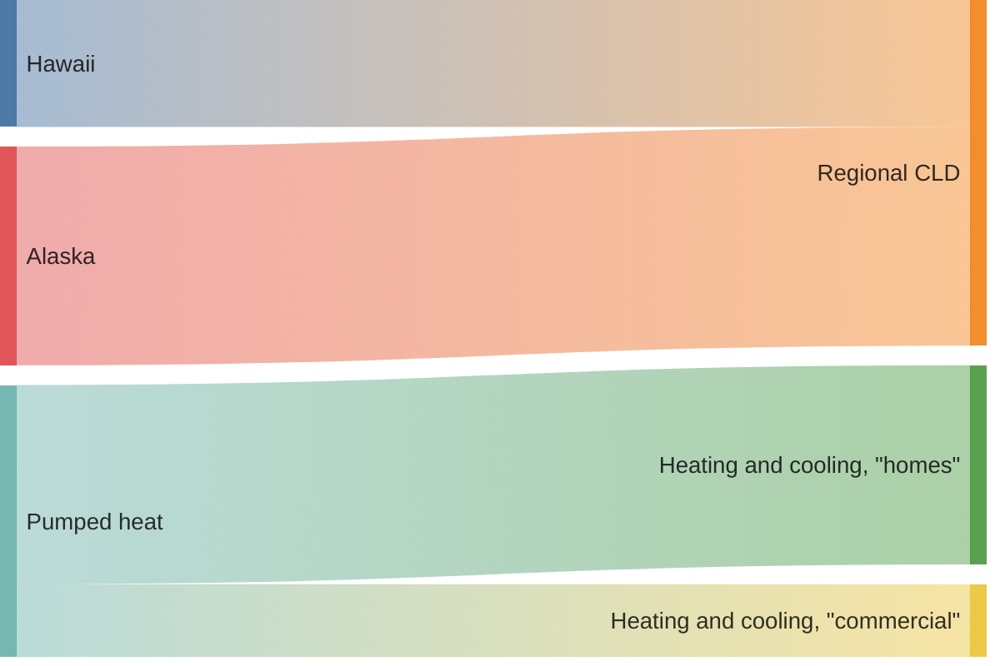

# sandbox-mermaid
Sandbox for testing Mermaid scripting to draw diagrams. Information on Mermaid can be found [here](https://mermaid.js.org/). Currently working on testing concurrent development of a model and interface.

# State diagram
Some text to separate the diagrams

# Sankey

